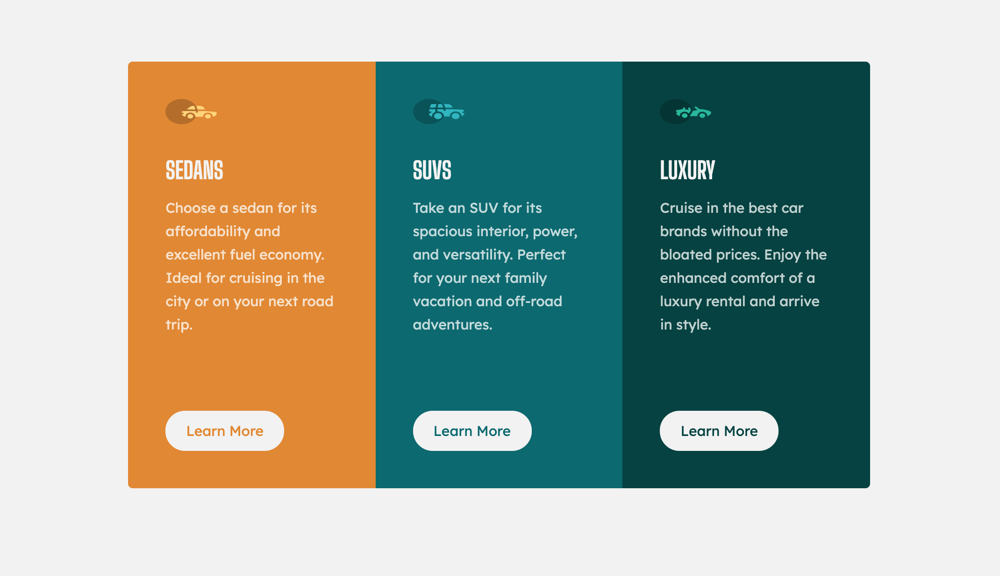

# Frontend Mentor - 3-column preview card component

This is a solution to the [3-column preview card component challenge on Frontend Mentor](https://www.frontendmentor.io/challenges/3column-preview-card-component-pH92eAR2-). Frontend Mentor challenges help you improve your coding skills by building realistic projects.

## Table of Contents

- [Screenshot](#screenshot)
- [Links](#links)
- [My process](#my-process)
- [Built with](#built-with)

### Screenshot

### Links

- Solution URL: [Add solution URL here](https://your-solution-url.com)
- Live Site URL: [Add live site URL here](https://your-live-site-url.com)

## My process

### Built with

- Semantic HTML5 markup
- CSS
- SASS/SCSS
- Flexbox
- CSS Grid
- Responsive Web design

## Author

- Website - [Brenda Michelle](https://brendamichellle.com/)
- Frontend Mentor - [@BrendaMichellle](https://www.frontendmentor.io/profile/BrendaMichellle)
- Youtube - [@BrendaMichellleTech](https://www.youtube.com/channel/UCCbwmyG1DlUxjYkPLIA9qzA)
